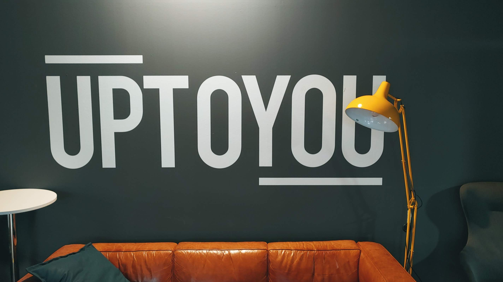
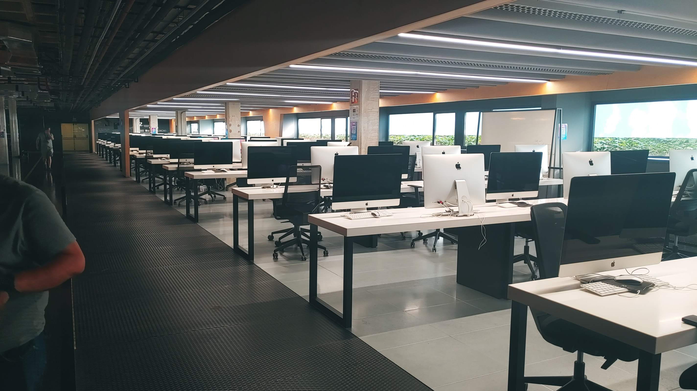
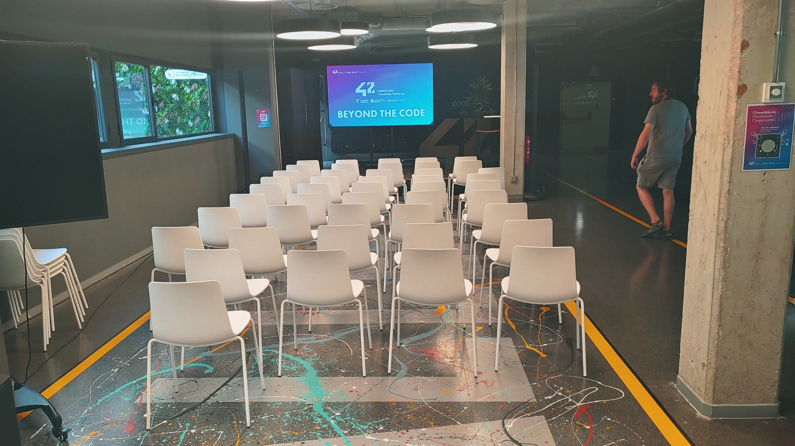

# Piscine-42-Barcelona
proceso de selección de 26 días del prestigioso campus de programación gratuito 42 Barcelona
## Experiencia durante la Piscina
Participar en la piscina ha sido una de las experiencias mas intensas y exigentes de mi vida. Tomar contacto con la terminal, Git y C desde cero y en un entorno sin profesores, donde hay que colaborar con otros candidatos de muy distintos bagajes o que también parten de cero en programación, te lleva por una montaña rusa donde es primordial gestionar la frustración y superar tus limites.

## Zona de trabajo
 

• Duración e intensidad: Consiste en 26 días consecutivos de inmersión presencial absoluta en su campus del distrito tecnológico de Barcelona.

• Coste: Es 100% gratuita, impulsada por la Fundación Telefónica junto al Ayuntamiento de Barcelona y la Generalitat de Catalunya.

• Requisitos: Únicamente ser mayor de 18 años; no se necesita ningún tipo de titulación ni experiencia previa en informática.

• Metodología: Se aprende resolviendo retos diarios, trabajando en equipo de forma cooperativa y realizando exámenes de código (en lenguaje C) todos los viernes.

• Disponibilidad: El campus está abierto 24 horas al día, 7 días a la semana, por lo que se recomienda una dedicación muy alta para asimilar el ritmo de trabajo.

